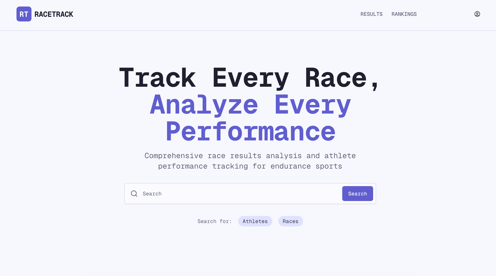

### Database
While I have been in classes this quarter I realized my database structure was pretty bad and was causing slow load times, and high database demands. I have been trying to determine the optimal method for storing the athlete data, race results, race data and athlete analysis while not having to pull large amounts of data for each page loaded. I think I have figured out a decent way to structure it. Following some guidance from a few AI's while also discussing it with other students who are more in the know than I am about this kind of thing I reached this structure:

#### Athletes

| Value      | Notes                                                              | Description                                |
| ---------- | ------------------------------------------------------------------ | ------------------------------------------ |
| id         | INT, PRIMARY KEY, AUTO_INCREMENT                                   | Unique athlete ID                          |
| first_name | VARCHAR(100) NOT NULL                                              | Athlete's first name                       |
| last_name  | VARCHAR(100) NOT NULL                                              | Athlete's last name                        |
| dob_year   | (DATE)                                                             | provides race age using year calculation   |
| gender     | ENUM('M','F','NB','O')                                             | For categorization                         |
| email      | VARCHAR(100), UNIQUE                                               | Contact info; unique to prevent duplicates |
| state      | (VARCHAR(50))                                                      | Optional location                          |
| country    | (VARCHAR(50))                                                      | Optional location                          |
| teamId     | (INT, NULL if no team)                                             | Foreign key to teams.id                    |
| createdAt  | (TIMESTAMP, DEFAULT CURRENT_TIMESTAMP))                            | When the record was created.               |
| updatedAt  | (TIMESTAMP, DEFAULT CURRENT_TIMESTAMP ON UPDATE CURRENT_TIMESTAMP) | Last update time                           |

##### Keys
INDEX: idx_name (last_name, first_name),
INDEX: idx_email (email)

#### Races

| Value         | Notes                                                              | Description                       |
| ------------- | ------------------------------------------------------------------ | --------------------------------- |
| race_id       | INT PRIMARY KEY AUTO_INCREMENT                                     | Unique race ID                    |
| race_name     | (VARCHAR(100), NOT NULL)                                           | race name                         |
| date          | DATE, NOT NULL                                                     | race date                         |
| location      | VARCHAR(255)                                                       | venue                             |
| city          | VARCHAR(100)                                                       | City                              |
| state         | VARCHAR(50)                                                        | State                             |
| country       | VARCHAR(100)                                                       | Country                           |
| distances     | JSON                                                               | in kilometers or miles            |
| distance_unit | ENUM('km', 'mi') DEFAULT 'km'                                      | distance units                    |
| race_type     | VARCHAR(50)                                                        | Race category                     |
| description   | TEXT                                                               | Optional details like course info |
| website_url   | VARCHAR(500)                                                       |                                   |
| createdAt     | (TIMESTAMP, DEFAULT CURRENT_TIMESTAMP)                             |                                   |
| updatedAt     | (TIMESTAMP, DEFAULT CURRENT_TIMESTAMP ON UPDATE CURRENT_TIMESTAMP) |                                   |

##### Keys
INDEX idx_race_date (race_date),
INDEX idx_location (city, state),
INDEX idx_race_type (race_type)

>[!Distances Field]
>{"Swim":1.4,"Bike":40,"Run":10}

#### Results

| Value           | Notes                                                              | Description                |
| --------------- | ------------------------------------------------------------------ | -------------------------- |
| id              | INT, PRIMARY KEY, AUTO_INCREMENT)                                  | Unique result ID           |
| athlete_id      | (INT, NOT NULL)                                                    | Foreign key to athletes.id |
| race_id         | (INT, NOT NULL)                                                    | Foreign key to races.id    |
| finish_time     | TIME                                                               |                            |
| position        | INT                                                                | overall placement          |
| ag_position     | INT                                                                | ag placement               |
| gender_position | INT                                                                | gender position            |
| elo_adjust      |                                                                    | +/- elo adjustment         |
| splits          | JSON                                                               |                            |
| notes           | TEXT                                                               |                            |
| dnf             | BOOLEAN DEFAULT=FALSE                                              |                            |
| dns             | BOOLEAN DEFAULT=FALSE                                              |                            |
| disqualified    | BOOLEAN DEFAULT=FALSE                                              |                            |
| penalty         | int                                                                | penalty in seconds         |
| createdAt       | (TIMESTAMP, DEFAULT CURRENT_TIMESTAMP)                             |                            |
| updatedAt       | (TIMESTAMP, DEFAULT CURRENT_TIMESTAMP ON UPDATE CURRENT_TIMESTAMP) |                            |

##### Keys:
FOREIGN KEY (race_id) REFERENCES races(race_id) ON DELETE CASCADE,
FOREIGN KEY (athlete_id) REFERENCES athletes(athlete_id) ON DELETE CASCADE,
UNIQUE KEY unique_race_athlete (race_id, athlete_id),
INDEX idx_race_results (race_id, finish_time_seconds),
INDEX idx_athlete_results (athlete_id, race_id),
INDEX idx_overall_place (race_id, overall_place),
INDEX idx_gender_place (race_id, gender_place)
ALTER TABLE results ADD INDEX idx_swim ( (CAST(splits->'$.swim' AS TIME)) )

splits are stored in a json like this:
>Splits & Ranks
>	{
>"swim": {
>>      "time": "00:25:30", "rank": 10, "cumulative_position": 10},
>
>"t1": {"time": "00:02:15", "rank": 8, "cumulative_position": 9},  
>
>"bike": {
>>      "time": "01:10:45", "rank": 6, "cumulative_position": 7,
>>      "intermediates": 
>>>         {"20km": {"time": "00:35:00", "rank": 7, "cumulative_position": 8}}},
>
>      "t2": {"time": "00:02:15", "rank": 8, "cumulative_position": 9},  
>
>	  "run":{
>>      "time":"0:32:45","rank":2,"cumulative_position": 5,
>>   	"intermediates":
>>>         {"5km":{"time":"00:10:00","rank":6","cumulative_position":5}}}
> }

#### Teams

| Value       | Notes                                                              | Description                                  |
| ----------- | ------------------------------------------------------------------ | -------------------------------------------- |
| id          | (INT, PRIMARY KEY, AUTO_INCREMENT)                                 | Unique team ID                               |
| name        | (VARCHAR(100), NOT NULL)                                           | Team name                                    |
| location    | (VARCHAR(100))                                                     | Optional city or country                     |
| description | (TEXT)                                                             | Optional details like founding year or motto |
| createdAt   | (TIMESTAMP, DEFAULT CURRENT_TIMESTAMP)                             | When the team was added                      |
| updatedAt   | (TIMESTAMP, DEFAULT CURRENT_TIMESTAMP ON UPDATE CURRENT_TIMESTAMP) | Last update time                             |

###### Keys
INDEX: idx_team (id)

##### Referencing
This system should allow for easier referencing, using the unique id to tie results to specific racers and races; and can then just pull ever race that has the required athlete id.
> [! Referencing]
> There are more notes to add here. Look into index rules how to properly call them

	How can I properly assign the unique id's for the results?

-> Slug needs to be unique for each athlete unique id page that is used
> should it be based on athlete, or race id? 
> 	Athlete Race Analysis: https://allresults.com/{race.id}/{athlete.id}
> 	Athlete: https://allresults.com/{athlete.id}
> 	Race: https://allresults.com/{race.id}

### UI Update
 

Additionally, as I have been working through the database issues some of my classmates exposed my to V0.dev an AI development tool created by [Vercel](vercel.com) which I have found to be adiquete for getting the preliminary design figured out for the site. 

I am trying to have as clean of a UI as possible with as few distractions as possible while also still being clear and easy to use. I feel like many sites are pretty busy making them more annoying to use than it should be; If they arent overly busy they just are not visually appealing, which also is frustrating to me. With modern AI agents it seems like it should be realitvely easy to get the foundation for a good easy to use clean UI without too much hassle, then all the end designer would have to do clean up the code and finalize aspects that AI missed.

While I havent been able to get all funcitonailty integrated again from where the design was a few months ago I have gotten it this far. Comparing the new UI and the old UI I am quite happy. I still feel like it requires a bit more compressing. 

Figure 2: New Athlete Results View

Figure 3: Old Athlete Results View

There are a few features I still want to integrate into the athlete profile, but I am a little worried about how much content I ahve in the top header. Along with that looking at the Figure 3 compared to Figure 2, while the newer design looks good, each race result entry takes up *SO* much space taht it start to get in the way, and I need to find a way to shring the results while still displaying all the content I want.

I am thinking it might be worth it to expand the main header all the way across the page to allow me to fit more information/content into the page there.

### Remaining key features to add:

I will go into these in a future post as there is quite a bit to go into for each of them. 

- Athlete Bubble
- Elo Score/Get elo score working
- Analysis Tab working
- Stats Tab

